# Jarkom-Modul-2-F11-2022

### Kelompok F11

| **No** | **Nama** | **NRP** | 
| ------------- | ------------- | --------- |
| 1 | Ryo Hilmi Ridho  | 5025201192 | 
| 2 | Moh. Ilham Fakhri Zamzami | 5025201275 |
| 3 | Putu Andhika Pratama | 5025201132 |
    
## Script
file `script.sh` pada root tiap node

- Ostania
    
    ```bash
    #!/bin/bash
    
    iptables -t nat -A POSTROUTING -o eth0 -j MASQUERADE -s 10.34.0.0/16
    ```
    
- SSS
    
    ```bash
    #!/bin/bash

    echo nameserver 192.168.122.1 > /etc/resolv.conf

    apt-get update
    apt-get install lynx -y
    apt-get install nano -y

    echo nameserver 10.34.2.2 > /etc/resolv.conf
    echo nameserver 10.34.3.2 >> /etc/resolv.conf
    ```
    
- Garden
    
    ```bash
    #!/bin/bash

    echo nameserver 192.168.122.1 > /etc/resolv.conf

    apt-get install nano -y

    echo nameserver 10.34.2.2 > /etc/resolv.conf
    echo nameserver 10.34.3.2 > /etc/resolv.conf
    ```
    
- WISE
    
    ```bash
    #!/bin/bash

    echo nameserver 192.168.122.1 > /etc/resolv.conf

    apt-get update
    apt-get install bind9 -y
    apt-get install nano -y

    mkdir /etc/bind/wise

    cp named.conf.local /etc/bind/named.conf.local
    cp wise.f11.com /etc/bind/wise/wise.f11.com
    cp 2.34.10.in-addr.arpa /etc/bind/wise/2.34.10.in-addr.arpa

    service bind9 restart
    ```

- Berlint
    
    ```bash
    #!/bin/bash

    echo nameserver 192.168.122.1 > /etc/resolv.conf
    apt-get update
    apt-get install bind9 -y
    apt-get install nano -y

    mkdir /etc/bind/operation

    cp named.conf.local /etc/bind/named.conf.local
    cp operation.wise.f11.com /etc/bind/operation/operation.wise.f11.com

    service bind9 restart
    ```
    
- Eden
    
    ```bash
    #!/bin/bash

    echo nameserver 192.168.122.1 > /etc/resolv.conf
    ```

## Soal 1

### Soal
WISE akan dijadikan sebagai DNS Master, Berlint akan dijadikan DNS Slave, dan Eden akan digunakan sebagai Web Server. Terdapat 2 Client yaitu SSS, dan Garden. Semua node terhubung pada router Ostania, sehingga dapat mengakses internet

### Jawaban
Buat Topologi sesuai soal
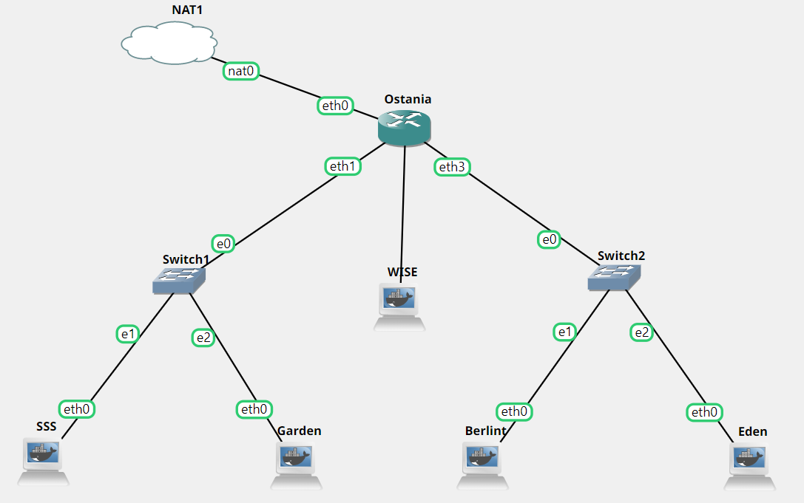

Edit network configuration tiap node
- Ostania

    ```
    auto eth0
    iface eth0 inet dhcp

    auto eth1
    iface eth1 inet static
        address 10.34.1.1
        netmask 255.255.255.0

    auto eth2
    iface eth2 inet static
        address 10.34.2.1
        netmask 255.255.255.0

    auto eth3
    iface eth3 inet static
        address 10.34.3.1
        netmask 255.255.255.0
    ```

- SSS

    ```
    auto eth0
    iface eth0 inet static
        address 10.34.1.2
        netmask 255.255.255.0
        gateway 10.34.1.1
    ```

- Garden

    ```
    auto eth0
    iface eth0 inet static
        address 10.34.1.3
        netmask 255.255.255.0
        gateway 10.34.1.1
    ```

- WISE

    ```
    auto eth0
    iface eth0 inet static
        address 10.34.2.2
        netmask 255.255.255.0
        gateway 10.34.2.1
    ```

- Berlint

    ```
    auto eth0
    iface eth0 inet static
        address 10.34.3.2
        netmask 255.255.255.0
        gateway 10.34.3.1
    ```

- Eden

    ```
    auto eth0
    iface eth0 inet static
        address 10.34.3.3
        netmask 255.255.255.0
        gateway 10.34.3.1
    ```

ketik `iptables -t nat -A POSTROUTING -o eth0 -j MASQUERADE -s 10.34.0.0/16` pada node Ostania

Masukan name server pada tiap node

`echo nameserver 192.168.122.1 > /etc/resolv.conf`

Lakukan `ping google.com` pada salah satu node

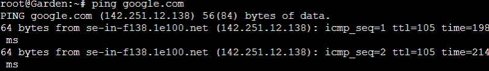

## Soal 2

### Soal
Untuk mempermudah mendapatkan informasi mengenai misi dari Handler, bantulah Loid membuat website utama dengan akses wise.yyy.com dengan alias www.wise.yyy.com pada folder wise

### Jawaban
pada root WISE buat file dengan `nano named.conf.local` lalu masukkan

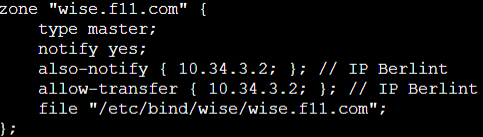

copy file ke /etc/bind/named.conf.local

`cp named.conf.local /etc/bind/named.conf.local`

Sekalian Berlint akan dijadikan DNS Slave. pada root Berlint buat file dengan `nano named.conf.local` sebagai slave

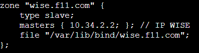

copy file ke /etc/bind/named.conf.local

`cp named.conf.local /etc/bind/named.conf.local`

pada node WISE buat folder wise dalam /etc/bind

`mkdir /etc/bind/wise`

copy file db.local pada path /etc/bind ke root WISE

`cp /etc/bind/db.local wise.f11.com`

lalu edit isinya

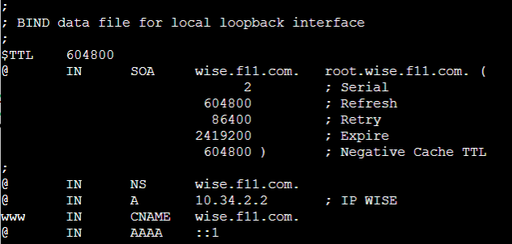

kemudian copy ke /etc/bind/wise/wise.f11.com

`cp wise.f11.com /etc/bind/wise/wise.f11.com`

lakukan `service bind9 restart`

pada node SSS dan Garden ganti nameserver pada `/etc/resolv.conf` menjadi IP WISE

`echo nameserver 10.34.2.2 > /etc/resolv.conf` dan `echo nameserver 10.34.3.2 >> /etc/resolv.conf`

lalu lakukan `ping www.wise.f11.com` pada SSS

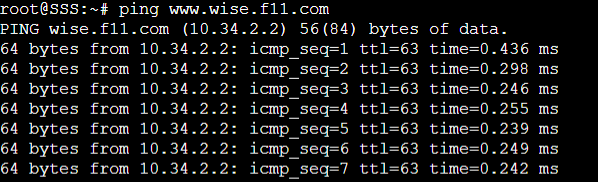


## Soal 3

### Soal
Setelah itu ia juga ingin membuat subdomain eden.wise.yyy.com dengan alias www.eden.wise.yyy.com yang diatur DNS-nya di WISE dan mengarah ke Eden

### Jawaban
Edit lagi file `wise.f11.com` pada root WISE dan tambahkan 2 line baru

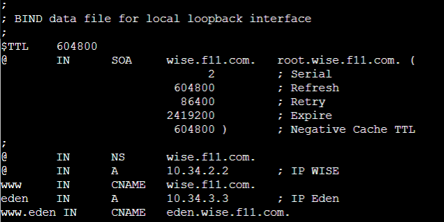

kemudian copy ke /etc/bind/wise/wise.f11.com

`cp wise.f11.com /etc/bind/wise/wise.f11.com`

restart bind9, lakukan ping ke domain baru

`ping eden.wise.f11.com` atau `ping www.eden.wise.f11.com`

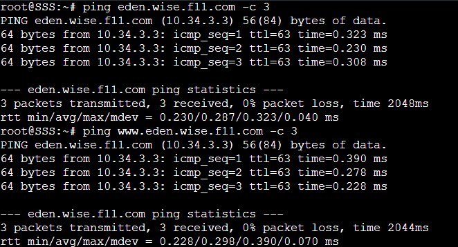

## Soal 4

### Soal
Buat juga reverse domain untuk domain utama

### Jawaban
Edit lagi file `named.conf.local` pada root WISE dan tambahkan

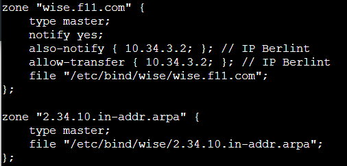

kemudian copy lagi ke /etc/bind/named.conf.local

`cp named.conf.local /etc/bind/named.conf.local`

Copy lagi file pada `/etc/bind/db.local` ke root WISE

`cp /etc/bind/db.local 2.34.10.in-addr.arpa`

lalu ubah isinya menjadi

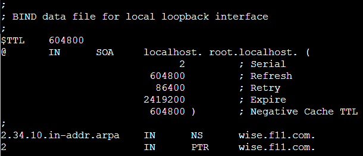

kemudian copy ke /etc/bind/wise/2.34.10.in-addr.arpa

`cp 2.34.10.in-addr.arpa /etc/bind/wise/2.34.10.in-addr.arpa`

restart bind9, lakukan `host -t PTR 10.34.2.2`


## Soal 5

### Soal
Agar dapat tetap dihubungi jika server WISE bermasalah, buatlah juga Berlint sebagai DNS Slave untuk domain utama

### Jawaban
Sudah dibuat pada nomor 2, kemudian coba matikan node WISE

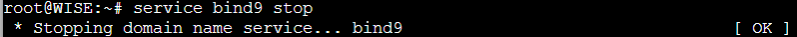

dan lakukan `ping wise.f11.com` pada node SSS

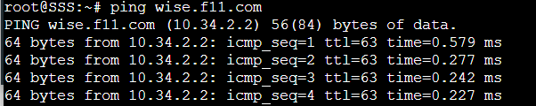

## Soal 6

### Soal
Karena banyak informasi dari Handler, buatlah subdomain yang khusus untuk operation yaitu operation.wise.yyy.com dengan alias www.operation.wise.yyy.com yang didelegasikan dari WISE ke Berlint dengan IP menuju ke Eden dalam folder operation

### Jawaban
Edit lagi file `wise.f11.com` pada root WISE dan tambahkan

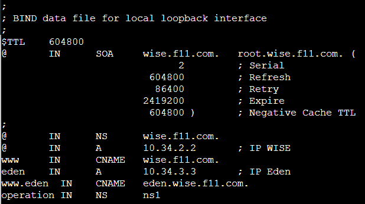

lalu copy kembali ke /etc/bind/wise/wise.f11.com, Kemudian pada root Berlint edit file `named.conf.local` tambahkan

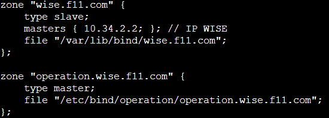

lalu copy lagi ke /etc/bind/named.conf.local

Kemudian pada node Berlint buat direktori dengan nama operation

`mkdir /etc/bind/operation`

Copy lagi file pada `/etc/bind/db.local` ke root Berlint

`cp /etc/bind/db.local operation.wise.f11.com`

lalu ubah file menjadi

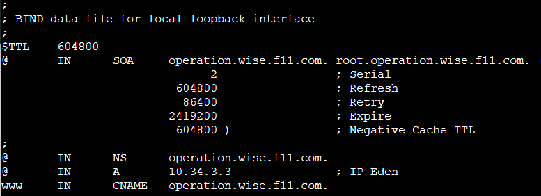

copy kan ke `/etc/bind/operation/operation.wise.f11.com`

`cp operation.wise.f11.com /etc/bind/operation/operation.wise.f11.com`

restart bind9 pada WISE dan Berlint, lakukan ping ke `operation.wise.f11.com` dan `www.operation.wise.f11.com`

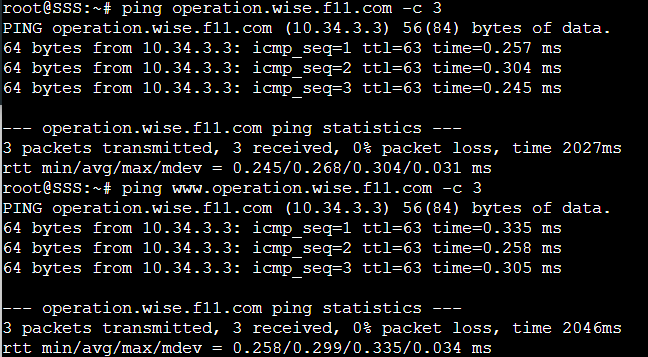
