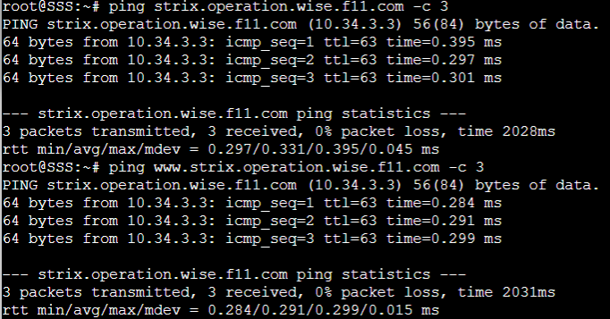

# Jarkom-Modul-2-F11-2022

### Kelompok F11

| **No** | **Nama** | **NRP** | 
| ------------- | ------------- | --------- |
| 1 | Ryo Hilmi Ridho  | 5025201192 | 
| 2 | Moh. Ilham Fakhri Zamzami | 5025201275 |
| 3 | Putu Andhika Pratama | 5025201132 |
    
## Script
file `script.sh` pada root tiap node

- Ostania

    ```bash
    #!/bin/bash
    
    iptables -t nat -A POSTROUTING -o eth0 -j MASQUERADE -s 10.34.0.0/16
    ```

- SSS

    ```bash
    #!/bin/bash

    echo nameserver 192.168.122.1 > /etc/resolv.conf

    apt-get update
    apt-get install lynx -y
    apt-get install nano -y

    echo nameserver 10.34.2.2 > /etc/resolv.conf
    echo nameserver 10.34.3.2 >> /etc/resolv.conf
    ```

- Garden

    ```bash
    #!/bin/bash

    echo nameserver 192.168.122.1 > /etc/resolv.conf

    apt-get install nano -y

    echo nameserver 10.34.2.2 > /etc/resolv.conf
    echo nameserver 10.34.3.2 > /etc/resolv.conf
    ```

- WISE

    ```bash
    #!/bin/bash

    echo nameserver 192.168.122.1 > /etc/resolv.conf

    apt-get update
    apt-get install bind9 -y
    apt-get install nano -y

    mkdir /etc/bind/wise

    cp named.conf.local /etc/bind/named.conf.local
    cp wise.f11.com /etc/bind/wise/wise.f11.com
    cp 2.34.10.in-addr.arpa /etc/bind/wise/2.34.10.in-addr.arpa

    service bind9 restart
    ```

- Berlint

    ```bash
    #!/bin/bash

    echo nameserver 192.168.122.1 > /etc/resolv.conf

    apt-get update
    apt-get install bind9 -y
    apt-get install nano -y

    mkdir /etc/bind/operation

    cp named.conf.local /etc/bind/named.conf.local
    cp operation.wise.f11.com /etc/bind/operation/operation.wise.f11.com

    service bind9 restart
    ```

- Eden

    ```bash
    #!/bin/bash

    echo nameserver 192.168.122.1 > /etc/resolv.conf

    apt-get install nano -y
    apt-get install bind9 -y
    apt-get install apache2 -y
    apt-get install php -y
    apt-get install libapache2-mod-php7.0

    service apache2 start
    htpasswd -b -c /etc/apache2/.htpasswd Twilight opStrix
    
    cp webserver/wise.f11.com.conf /etc/apache2/sites-available
    cp webserver/eden.wise.f11.com.conf /etc/apache2/sites-available
    cp webserver/strix.operation.wise.f11.com-15000.conf /etc/apache2/sites-available/
    cp webserver/strix.operation.wise.f11.com-15500.conf /etc/apache2/sites-available/

    a2ensite wise.f11.com
    a2ensite eden.wise.f11.com
    a2ensite strix.operation.wise.f11.com-15000.conf
    a2ensite strix.operation.wise.f11.com-15000.conf

    service apache2 restart

    cp -r wise /var/www/wise.f11.com
    cp -r eden.wise /var/www/eden.wise.f11.com
    cp -r strix.operation.wise /var/www/strix.operation.wise.f11.com
    ```

- Eden (hanya dijalankan sekali diawal)

    ```bash
    #!/bin/bash

    apt-get install wget -y
    apt-get install unzip -y

    wget 'https://docs.google.com/uc?export=download&id=1q9g6nM85bW5T9f5yoyXtDqonUKKCHOTV' -O 'eden.wise.zip'
    wget 'https://docs.google.com/uc?export=download&id=1bgd3B6VtDtVv2ouqyM8wLyZGzK5C9maT' -O 'strix.operation.wise.zip'
    wget 'https://docs.google.com/uc?export=download&id=1S0XhL9ViYN7TyCj2W66BNEXQD2AAAw2e' -O 'wise.zip'

    unzip eden.wise.zip
    unzip strix.operation.wise.zip
    unzip wise.zip
    ```

## Soal 1

### Soal
WISE akan dijadikan sebagai DNS Master, Berlint akan dijadikan DNS Slave, dan Eden akan digunakan sebagai Web Server. Terdapat 2 Client yaitu SSS, dan Garden. Semua node terhubung pada router Ostania, sehingga dapat mengakses internet

### Jawaban
Buat Topologi sesuai soal


Edit network configuration tiap node
- Ostania

    ```
    auto eth0
    iface eth0 inet dhcp

    auto eth1
    iface eth1 inet static
        address 10.34.1.1
        netmask 255.255.255.0

    auto eth2
    iface eth2 inet static
        address 10.34.2.1
        netmask 255.255.255.0

    auto eth3
    iface eth3 inet static
        address 10.34.3.1
        netmask 255.255.255.0
    ```

- SSS

    ```
    auto eth0
    iface eth0 inet static
        address 10.34.1.2
        netmask 255.255.255.0
        gateway 10.34.1.1
    ```

- Garden

    ```
    auto eth0
    iface eth0 inet static
        address 10.34.1.3
        netmask 255.255.255.0
        gateway 10.34.1.1
    ```

- WISE

    ```
    auto eth0
    iface eth0 inet static
        address 10.34.2.2
        netmask 255.255.255.0
        gateway 10.34.2.1
    ```

- Berlint

    ```
    auto eth0
    iface eth0 inet static
        address 10.34.3.2
        netmask 255.255.255.0
        gateway 10.34.3.1
    ```

- Eden

    ```
    auto eth0
    iface eth0 inet static
        address 10.34.3.3
        netmask 255.255.255.0
        gateway 10.34.3.1
    ```

ketik `iptables -t nat -A POSTROUTING -o eth0 -j MASQUERADE -s 10.34.0.0/16` pada node Ostania

Masukan name server pada tiap node

`echo nameserver 192.168.122.1 > /etc/resolv.conf`

Lakukan `ping google.com` pada salah satu node


## Soal 2

### Soal
Untuk mempermudah mendapatkan informasi mengenai misi dari Handler, bantulah Loid membuat website utama dengan akses wise.yyy.com dengan alias www.wise.yyy.com pada folder wise

### Jawaban
pada root WISE buat file dengan `nano named.conf.local` lalu masukkan


copy file ke /etc/bind/named.conf.local

`cp named.conf.local /etc/bind/named.conf.local`

Sekalian Berlint akan dijadikan DNS Slave. pada root Berlint buat file dengan `nano named.conf.local` sebagai slave


copy file ke /etc/bind/named.conf.local

`cp named.conf.local /etc/bind/named.conf.local`

pada node WISE buat folder wise dalam /etc/bind

`mkdir /etc/bind/wise`

copy file db.local pada path /etc/bind ke root WISE

`cp /etc/bind/db.local wise.f11.com`

lalu edit isinya


kemudian copy ke /etc/bind/wise/wise.f11.com

`cp wise.f11.com /etc/bind/wise/wise.f11.com`

lakukan `service bind9 restart`

pada node SSS dan Garden ganti nameserver pada `/etc/resolv.conf` menjadi IP WISE

`echo nameserver 10.34.2.2 > /etc/resolv.conf` dan `echo nameserver 10.34.3.2 >> /etc/resolv.conf`

lalu lakukan `ping www.wise.f11.com` pada SSS


## Soal 3

### Soal
Setelah itu ia juga ingin membuat subdomain eden.wise.yyy.com dengan alias www.eden.wise.yyy.com yang diatur DNS-nya di WISE dan mengarah ke Eden

### Jawaban
Edit lagi file `wise.f11.com` pada root WISE dan tambahkan 2 line baru


kemudian copy ke /etc/bind/wise/wise.f11.com

`cp wise.f11.com /etc/bind/wise/wise.f11.com`

restart bind9, lakukan ping ke domain baru

`ping eden.wise.f11.com` atau `ping www.eden.wise.f11.com`


## Soal 4

### Soal
Buat juga reverse domain untuk domain utama

### Jawaban
Edit lagi file `named.conf.local` pada root WISE dan tambahkan


kemudian copy lagi ke /etc/bind/named.conf.local

`cp named.conf.local /etc/bind/named.conf.local`

Copy lagi file pada `/etc/bind/db.local` ke root WISE

`cp /etc/bind/db.local 2.34.10.in-addr.arpa`

lalu ubah isinya menjadi


kemudian copy ke /etc/bind/wise/2.34.10.in-addr.arpa

`cp 2.34.10.in-addr.arpa /etc/bind/wise/2.34.10.in-addr.arpa`

restart bind9, lakukan `host -t PTR 10.34.2.2`


## Soal 5

### Soal
Agar dapat tetap dihubungi jika server WISE bermasalah, buatlah juga Berlint sebagai DNS Slave untuk domain utama

### Jawaban
Sudah dibuat pada nomor 2, kemudian coba matikan node WISE


dan lakukan `ping wise.f11.com` pada node SSS


## Soal 6

### Soal
Karena banyak informasi dari Handler, buatlah subdomain yang khusus untuk operation yaitu operation.wise.yyy.com dengan alias www.operation.wise.yyy.com yang didelegasikan dari WISE ke Berlint dengan IP menuju ke Eden dalam folder operation

### Jawaban
Edit lagi file `wise.f11.com` pada root WISE dan tambahkan


lalu copy kembali ke /etc/bind/wise/wise.f11.com, Kemudian pada root Berlint edit file `named.conf.local` tambahkan


lalu copy lagi ke /etc/bind/named.conf.local

Kemudian pada node Berlint buat direktori dengan nama operation

`mkdir /etc/bind/operation`

Copy lagi file pada `/etc/bind/db.local` ke root Berlint

`cp /etc/bind/db.local operation.wise.f11.com`

lalu ubah file menjadi


copy kan ke `/etc/bind/operation/operation.wise.f11.com`

`cp operation.wise.f11.com /etc/bind/operation/operation.wise.f11.com`

restart bind9 pada WISE dan Berlint, lakukan ping ke `operation.wise.f11.com` dan `www.operation.wise.f11.com`


## Soal 7

### Soal
Untuk informasi yang lebih spesifik mengenai Operation Strix, buatlah subdomain melalui Berlint dengan akses strix.operation.wise.yyy.com dengan alias www.strix.operation.wise.yyy.com yang mengarah ke Eden

### Jawaban
Pada node Berlint edit lagi file `operation.wise.f11.com` pada root WISE dan tambahkan 2 line baru


copy kembali ke `/etc/bind/operation/operation.wise.f11.com`

restart bind9, lakukan ping ke `strix.operation.wise.f11.com` dan `www.strix.operation.wise.f11.com`



## Soal 8

### Soal
Setelah melakukan konfigurasi server, maka dilakukan konfigurasi Webserver. Pertama dengan webserver www.wise.yyy.com. Pertama, Loid membutuhkan webserver dengan DocumentRoot pada /var/www/wise.yyy.com

### Jawaban
Pada script di node Eden (hanya dijalankan sekali diawal)
```bash
    apt-get install wget -y
    apt-get install unzip -y

    wget 'https://docs.google.com/uc?export=download&id=1q9g6nM85bW5T9f5yoyXtDqonUKKCHOTV' -O 'eden.wise.zip'
    wget 'https://docs.google.com/uc?export=download&id=1bgd3B6VtDtVv2ouqyM8wLyZGzK5C9maT' -O 'strix.operation.wise.zip'
    wget 'https://docs.google.com/uc?export=download&id=1S0XhL9ViYN7TyCj2W66BNEXQD2AAAw2e' -O 'wise.zip'

    unzip eden.wise.zip
    unzip strix.operation.wise.zip
    unzip wise.zip
```

Edit file `/etc/bind/wise/wise.f11.com` ubah menjadi IP Eden


Install apache2 dan php di Berlint dan Eden, kemudian pada Eden copy `/etc/apache2/sites-available/000-default.conf` ke folder `webserver/wise.f11.com.conf` pada root Eden, sebelumnya buat dulu folder webserver-nya. Lalu edit isinya


lalu copykan ke /etc/apache2/sites-available/wise.f11.com.conf

`cp webserver/wise.f11.com.conf /etc/apache2/sites-available/wise.f11.com.conf`

lalu aktifkan konfigurasi dengan `a2ensite wise.f11.com`

kemudian restart apachenya

`service apache2 restart`

kemudian copy file yang tadi sudah di download ke dalam file `/var/www/`

```bash
    cp -r wise /var/www/wise.f11.com
    cp -r eden.wise /var/www/eden.wise.f11.com
    cp -r strix.operation.wise /var/www/strix.operation.wise.f11.com
```

Pada node SSS jalankan `lynx www.wise.f11.com`


## Soal 9

### Soal
Setelah itu, Loid juga membutuhkan agar url www.wise.yyy.com/index.php/home dapat menjadi menjadi www.wise.yyy.com/home

### Jawaban
Pada root Eden edit file `webserver/wise.f11.com.conf`


lalu copy lagi ke /etc/apache2/sites-available/wise.f11.com.conf

`cp webserver/wise.f11.com.conf /etc/apache2/sites-available/wise.f11.com.conf`

restart apache, kemudian pada node SSS jalankan `lynx http://wise.f11.com/home`


## Soal 10

### Soal
Setelah itu, pada subdomain www.eden.wise.yyy.com, Loid membutuhkan penyimpanan aset yang memiliki DocumentRoot pada /var/www/eden.wise.yyy.com

### Jawaban
Pada node Eden copy file `wise.f11.com.conf` pada folder webserver dengan nama `eden.wise.f11.com.conf`

`cp webserver/wise.f11.com.conf webserver/eden.wise.f11.com.conf`

lalu edit isinya


lalu copy ke /etc/apache2/sites-available/eden.wise.f11.com.conf

`cp webserver/eden.wise.f11.com.conf /etc/apache2/sites-available/eden.wise.f11.com.conf`

lalu aktifkan konfigurasi dengan `a2ensite eden.wise.f11.com`

kemudian restart apachenya

`service apache2 restart`

Pada node SSS jalankan `lynx www.eden.wise.f11.com`


## Soal 11

### Soal
Akan tetapi, pada folder /public, Loid ingin hanya dapat melakukan directory listing saja

### Jawaban
Pada node Eden edit file `webserver/eden.wise.f11.com.conf`


copy lagi ke /etc/apache2/sites-available/eden.wise.f11.com.conf

restart apache, pada node SSS jalankan `lynx www.eden.wise.f11.com`


## Soal 12

### Soal
Tidak hanya itu, Loid juga ingin menyiapkan error file 404.html pada folder /error untuk mengganti error kode pada apache

### Jawaban
Pada node Eden edit lagi file `webserver/eden.wise.f11.com.conf`


copy lagi ke /etc/apache2/sites-available/eden.wise.f11.com.conf

restart apache, pada node SSS jalankan dengan akhiran sembarang


## Soal 13

### Soal
Loid juga meminta Franky untuk dibuatkan konfigurasi virtual host. Virtual host ini bertujuan untuk dapat mengakses file asset www.eden.wise.yyy.com/public/js menjadi www.eden.wise.yyy.com/js

### Jawaban
Pada node Eden edit lagi file `webserver/eden.wise.f11.com.conf`


copy lagi ke /etc/apache2/sites-available/eden.wise.f11.com.conf

restart apache, jalankan pada node SSS

`lynx www.eden.wise.f11.com/js`


## Soal 14

### Soal
Loid meminta agar www.strix.operation.wise.yyy.com hanya bisa diakses dengan
port 15000 dan port 15500

### Jawaban
Untuk port 15000, buat file config baru dengan nama `strix.operation.wise.f11.com-15000.conf`

`cp /etc/apache2/sites-available/000-default.conf webserver/strix.operation.wise.f11.com-15000.conf`

lalu edit filenya


lalu copy ke `/etc/apache2/sites-available/`

`cp webserver/strix.operation.wise.f11.com-15000.conf /etc/apache2/sites-available/`

Buat juga untuk port 15500.

Pada file `/etc/apache2/ports.conf` tambahkan listen port 15000 dan 15500


a2ensite kedua config, `a2ensite strix.operation.wise.f11.com-15000.conf` dan `a2ensite strix.operation.wise.f11.com-15500.conf`

restart apache, jalankan pada node SSS

`lynx www.strix.operation.wise.f11.com:15000`/`lynx www.strix.operation.wise.f11.com:15500`


## Soal 15

### Soal
dengan autentikasi username Twilight dan password opStrix dan file di /var/www/strix.operation.wise.yyy

### Jawaban
bikin password dengan

`htpasswd -b -c /etc/apache2/.htpasswd Twilight  opStrix`


lalu edit config pada `strix.operation.wise.f11.com-15000.conf` dan `strix.operation.wise.f11.com-15500.conf`


restart apache, jalankan pada node SSS

`lynx www.strix.operation.wise.f11.com:15000`/`lynx www.strix.operation.wise.f11.com:15500`

maka akan diminta untuk memasukkan username dan password


masukkan username Twilight dan password opStrix


## Soal 16

### Soal
setiap kali mengakses IP Eden akan dialihkan secara otomatis ke www.wise.yyy.com

### Jawaban
Pada node Eden jalankan `a2enmod rewrite` untuk mengaktifkan module rewrite

kemudian restart apache `service apache2 restart`

buat file baru dengan perintah `nano /var/www/wise.f11.com/.htaccess`

isi dengan kode berikut
```
RewriteEngine On
RewriteBase /
RewriteCond %{HTTP_HOST} ^10\.34\.3\.3$
RewriteRule ^(.*)$ http://www.wise.f11.com/$1 [L,R=301]
```


Edit isi dari `/etc/apache2/sites-available/000-default.conf` menjadi


Kemudian, restard apachenya dengan `service apache2 restart` dan coba jalankan `lynx 10.34.3.3` pada node SSS

dan didapatkan hasil sebagai berikut


## Soal 17

### Soal
Karena website www.eden.wise.yyy.com semakin banyak pengunjung dan banyak modifikasi sehingga banyak gambar-gambar yang random, maka Loid ingin mengubah request gambar yang memiliki substring “eden” akan diarahkan menuju eden.png. Bantulah Agent Twilight dan Organisasi WISE menjaga perdamaian!

### Jawaban
Pada node Eden jalankan `a2enmod rewrite` untuk mengaktifkan module rewrite

buat file baru dengan perintah `nano /var/www/eden.wise.f11.com/.htaccess`

isi dengan kode berikut
```
RewriteEngine On
RewriteBase /
RewriteCond %{REQUEST_URI} ^/public/images/(.*)eden(.*)
RewriteRule .* http://www.eden.wise.f11.com/public/images/eden.png [L,R=301
```
Edit isi dari `/etc/apache2/sites-available/000-default.conf` menjadi


kemudian restart apache `service apache2 restart`

Jalankan `lynx www.eden.wise.f11.com/public/images/not-eden.png`

dan didapatkan hasil sebagai berikut

